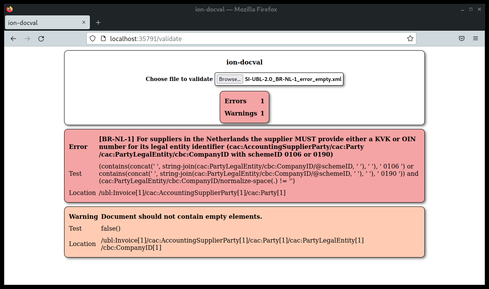

# ion-docval manual

## Introduction

ion-docval is an XML document validator written in Java, which supports validating documents against multiple validation files, and supports multiple validation formats. These formats are:

- XML Schema (.xsd files)
- Schematron (.sch files)
- SVRL Transformation files (.xsl/.xslt files, but only those for SVRL, i.e. those created from Schematron files)

With ion-docval, you can run a local validation service without having to upload your documents to an online validation tool.

This is the same software that is used as part of the [NPa Peppol Test Tool](https://test.peppolautoriteit.nl/validate).

## Installation

Note: this distribution does not include the Java runtime environment, nor any ready-to-use validation files. You will need to download and configure those yourself. See the section 'Where to get validation files' for a few examples.

Installation instructions:

1. Download and install the latest Java runtime environment if you do not have one installed.
2. Download the necessary XML Schema, Schematron or Schematron XSLT files for the document types you need to validate.
2. Extract the ion-docval zip file to the directory of your choosing.
3. Go to the extracted directory and copy `ion-docval.conf.sample` to `ion-docval.conf`
4. Edit `ion-docval.conf`, uncomment or add document types, and update their values as necessary.

See the Configuration section for more details.

## Usage

ion-docval comes with three tools: ion-docval-server, ion-docval-client, and ion-docval-command-line.

### ion-docval-server

This is the main tool that performs the validation. When running, it acts as a small webserver that serves a page where you can validate documents and as an API for continuous or bulk validation.

Given the defaults from the sample configuration file, it will listen on localhost port 35791. You can access it with any webbrowser by visiting the page:

https://localhost:35791/validate

That page contains a single form field, where you can select any .xml document type that matches one of the keywords in the current configuration.

For more information on the API, see the section 'Server API'.

### ion-docval-client

ion-docval-client can send requests to ion-docval-server for a more automated use of the validation service. It sends the given document to a running server, and prints out the result. This tool is intended to be incorporated in scripts or batch jobs, in those cases where ion-docval is not integrated as a library directly. It is recommended to use the client (or a different client script) together with the server if you want to validate many documents, or want to validate documents regularly.

### ion-docval-client.py

This is a second implementation of the server client, but written in python. This client is slightly faster to execute (less startup time), and also serves as a second example of a client.

### ion-docval-command-line

This is a standalone command-line version of the validator. It can validate a document against one or more validation files, specified on the command-line. This tool is intended for quickly checking validion files, or in the case where you only need to validate a single file once. Due to the slow start-up time of Java and potential slow loading of validation files, it is not recommended to use this tool to validate multiple documents.

## Performance

Using .sch files directly is easier to set up, as you won't have to convert them to .xsl yourself. However, this does slow down the (re)loading of the validation file a lot. It may take tens of seconds to load a single file, depending on the size of the schematron file. Once loaded, it is as efficient as loading an SVRL .xsl file directly, but we recommend using .xsl files.

## Configuration

### Configuration File Location

You can specify the location of the configuration file (default: ion-docval.conf) with the -c/--config argument. If you do not specify a configuration file, the software will try these three locations, in order:
1. $HOME/.config/ion-docval.conf
2. /etc/ion-docval.conf
3. ion-docval.conf in the current working directory.

### Options section

* AutoReload: [true/false] specifies whether validation files should be automatically reloaded when they change on disk. Note that this may cause an initial delay with the first request after the change, while the validation file is reloaded.
* UnknownKeywords: [warn/error/fail/ignore] specifies what the validator should do when a document is validated with a keyword that is not in the configuration.
  * warn: Return a normal validation result, but add a warning about the unknown keyword. This warning will be the only content of the result
  * error: Return a normal validation result, but add an error about the unknown keyword. This error will be the only content of the result
  * ignore: Return an empty validation result, with 0 errors and 0 warnings
  * fail: Return a hard error that the document cannot be validated. In a web browser, this will be an error alert. On the HTTP level, it will be a 400 client error.
* LazyLoad: [true/false] when true, the validation files will not be loaded into memory until they are first used. This will speed up start time at the cost of initial reaction response time of each document type

### Server section

In the Server Section, you can specify one or more address/port combinations to listen on. The defaults should in general be fine.

Note that it is highly unadvisable to change the IP address to anything other than 127.0.0.1, and especially to any public routable IP address. The internal web server is very minimal and offers not security features such as TLS or IP whitelisting. If you want to run the server validator so that it is reachable from a wider network, we strongly advise to do so through a reverse proxy such as nginx, which can provide these features.

Each Listen entry has the following values:

* Address: [IP address] The IP address to listen on
* Port: [integer] The port number to listen on

### Document type section

This is where you define which types of document ion-docval will validate for you. You can specify as many DocumentType entries as you wish, as long as the Keyword value that is used is unique.

Each entry contains the following elements:

* Name: [string] A user-friendly name for this document type, such as 'SI-UBL 2.0'
* Description: [string] A description of this document type
* Keyword: [string] The keyword by which the server will know which document type a certain document needs to be validated against. See the section Keywords for more information
* ValidationFile: [filename] A validation file that documents of this type should be validated against. The filename must end in either .xsd (for XML Schema files), .sch (for Schematron files), or .xsl (for SVRL stylesheets). You can specify multiple ValidationFile entries for each document type.

### Keywords

Keywords are the way ion-docval-server will choose which set of validation files to use when validating any given document.

If you use the command-line client, or use the jar library directly, you may be in a situation where the caller knows exactly which document type a given document has. In that case, you are free to choose the keyword you wish to use for each document type, as long as every keyword is unique.

For ion-docval-server, or any case where the caller may *not* know exactly which keyword to use, there is a strict process of deriving the keyword from any given document. The keyword you use in your configuration MUST follow this process as well. For convenience, the ion-docval-cli tool provides an option to derive the keyword from a document in the same way that the server will, so you can use that value in your configuration.

The format depends on whether or not the document is a UBL document, a CII document, or any other XML document, and comprises up to 4 elements:

1. namespace: The XML namespace of the root element (if any)
2. root element: The tag name of the root element (e.g. Invoice)
3. Customization ID: The customization ID for UBL, or the GuideLineSpecifiedDocumentContextParameter in case of CII
4. version: The UBL version in case of UBL, or D16B in case of CII.

Depending on the general document type, this makes the following formats:
* UBL: `<namespace>::<root element>##<customization id>::<version>`
* CII: `<namespace>::<root element>##<customization id>::D16B`
* Any other xml with namespaces: `<namespace>::<root element>`
* Any other xml without namespaces: `<root element>`

When using the command-line client ion-docval-client, or when calling the library directly, you can specify a specific keyword of your own choosing, as long as it matches the correct keyword from the configuration.

## Sample configuration file

    <Config>
        <Options>
            <!-- 
                Set this to true to automatically reload validation
                files when they change on disk.
            -->
            <AutoReload>true</AutoReload>
            <!--
                 Set this to true to Only load validation files when
                 they are needed. This speeds up start-up time, but
                 results in a slower response on first use.
             -->
            <LazyLoad>false</LazyLoad>
            <!-- 
                How to handle requests for unknown keywords. Options:
                - ignore: return a validation result with 0 errors and 0 warnings
                - warn: return a validation result with 0 errors and an unknown keyword warning
                - error: return a validation result with an unknown keyword error and 0 warnings
                - fail: throw a ValidatorError (resulting in an HTTP error in the server context)
            -->
            <UnknownKeywords>error</UnknownKeywords>
        </Options>
        <Server>
            <!--
                Specify on which IP addresses and ports to listen for requests.
                Unless otherwise protected, we strongly suggest using localhost
                only, and assing security features such as TLS and access control
                through a reverse proxy such as Nginx or Apache.
            -->
            <Listen>
                <Address>127.0.0.1</Address>
                <Port>35791</Port>
            </Listen>
        </Server>

        <!-- A sample document type with some path suggestions for unix systems -->
        <!--
        <DocumentType>
            <Name>SI-UBL 2.0</Name>
            <Description>SI-UBL 2.0 (NLCIUS)</Description>
            <Keyword>urn:oasis:names:specification:ubl:schema:xsd:Invoice-2::Invoice##urn:cen.eu:en16931:2017#compliant#urn:fdc:nen.nl:nlcius:v1.0::2.1</Keyword>
            <ValidationFile>/etc/ion-docval/xsd/xsd_ubl2.1/maindoc/UBL-Invoice-2.1.xsd</ValidationFile>
            <ValidationFile>/etc/ion-docval/xsl/si-ubl-2.0.xsl</ValidationFile>
        </DocumentType>
        -->

        <!-- A sample document type with some path suggestions for Windows systems -->
        <!--
        <DocumentType>
            <Name>SI-UBL 2.0</Name>
            <Description>SI-UBL 2.0 (NLCIUS)</Description>
            <Keyword>urn:oasis:names:specification:ubl:schema:xsd:Invoice-2::Invoice##urn:cen.eu:en16931:2017#compliant#urn:fdc:nen.nl:nlcius:v1.0::2.1</Keyword>
            <ValidationFile>C:\ion-docval\validation-files\xsd\xsd_ubl2.1\maindoc\UBL-Invoice-2.1.xsd</ValidationFile>
            <ValidationFile>C:\ion-docval\validation-files\xsl\si-ubl-2.0.xsl</ValidationFile>
        </DocumentType>
        -->

    </Config>

## Where to get validation files

Here are some examples of files you can download to set up your validation.

### Peppol BIS (UBL)

If you want to validate Peppol BIS UBL documents, you'll need 3 separate validation files:

1. Whether the document is a valid UBL document, through the relevant 'maindoc' files from OASIS: [UBL xsd](https://docs.oasis-open.org/ubl/os-UBL-2.1/xsd/) (note: you'll need every file in common/ and the relevant files for your document type, such as Invoice-2 or Order-2, from maindoc/)
2. Whether the document is a valid EN-16931 document, through the schematron file [provided by OpenPeppol](https://docs.peppol.eu/poacc/billing/3.0/files/CEN-EN16931-UBL.sch)
3. Whether the document is a valid Peppol BIS document, through the schematron file [also provided by OpenPeppol](https://docs.peppol.eu/poacc/billing/3.0/files/PEPPOL-EN16931-UBL.sch)

### NLCIUS

If you want to validate SI-UBL 2.0 (NLCIUS) documents, you'll need 2 validation files:

1. Whether the document is a valid UBL document, through the relevant 'maindoc' files from OASIS: [UBL xsd](https://docs.oasis-open.org/ubl/os-UBL-2.1/xsd/) (note: you'll need every file in common/ and the relevant files for your document type, such as Invoice-2 or Order-2, from maindoc/). This is the same as for Peppol BIS (or any UBL 2.1 document).
2. The SI-UBL xsl validation file, which can be found on the [NPA's github](https://github.com/peppolautoriteit.nl/validation)

## Server Web API

You can also write your own tooling to make use of the server's web API. You can use the two client implementations as examples, but the API itself is pretty basic.

There are currently two endpoints: one to perform the validation of a single document, and one to retrieve a list of document types that are configured by the server, and their keywords.

### Validating a document

Endpoint URI (with default settings): http://localhost:35791/api/validate
Method: POST
Content-Type: application/xml
Accept: either application/xml or application/json
Query parameters: keyword (optional, keyword derivation is used if no keyword is provided)

The body of the POST should contain the XML data itself.

Sample response (JSON):

    {
      "warning_count": 1,
      "error_count": 1,
      "warnings": [
        {
          "test": "false()",
          "location": "/*:Invoice[namespace-uri()='urn:oasis:names:specification:ubl:schema:xsd:Invoice-2'][1]/*:AccountingSupplierParty[namespace-uri()='urn:oasis:names:specification:ubl:schema:xsd:CommonAggregateComponents-2'][1]/*:Party[namespace-uri()='urn:oasis:names:specification:ubl:schema:xsd:CommonAggregateComponents-2'][1]/*:PartyLegalEntity[namespace-uri()='urn:oasis:names:specification:ubl:schema:xsd:CommonAggregateComponents-2'][1]/*:CompanyID[namespace-uri()='urn:oasis:names:specification:ubl:schema:xsd:CommonBasicComponents-2'][1]",
          "message": "Document should not contain empty elements."
        }
      ],
      "errors": [
        {
          "test": "(contains(concat(' ', string-join(cac:PartyLegalEntity/cbc:CompanyID/@schemeID, ' '), ' '), ' 0106 ') or contains(concat(' ', string-join(cac:PartyLegalEntity/cbc:CompanyID/@schemeID, ' '), ' '), ' 0190 ')) and (cac:PartyLegalEntity/cbc:CompanyID/normalize-space(.) != '')",
          "location": "/*:Invoice[namespace-uri()='urn:oasis:names:specification:ubl:schema:xsd:Invoice-2'][1]/*:AccountingSupplierParty[namespace-uri()='urn:oasis:names:specification:ubl:schema:xsd:CommonAggregateComponents-2'][1]/*:Party[namespace-uri()='urn:oasis:names:specification:ubl:schema:xsd:CommonAggregateComponents-2'][1]",
          "message": "[BR-NL-1] For suppliers in the Netherlands the supplier MUST provide either a KVK or OIN number for its legal entity identifier (cac:AccountingSupplierParty/cac:Party/cac:PartyLegalEntity/cbc:CompanyID with schemeID 0106 or 0190)"
        }
      ]
    }

Sample response (XML):

    <?xml version="1.0" encoding="UTF-8"?>
    <ValidationResult>
       <ErrorCount>1</ErrorCount>
       <WarningCount>1</WarningCount>
       <Errors>
          <Error>
             <Message>[BR-NL-1] For suppliers in the Netherlands the supplier MUST provide either a KVK or OIN number for its legal entity identifier (cac:AccountingSupplierParty/cac:Party/cac:PartyLegalEntity/cbc:CompanyID with schemeID 0106 or 0190)</Message>
             <Test>(contains(concat(' ', string-join(cac:PartyLegalEntity/cbc:CompanyID/@schemeID, ' '), ' '), ' 0106 ') or contains(concat(' ', string-join(cac:PartyLegalEntity/cbc:CompanyID/@schemeID, ' '), ' '), ' 0190 ')) and (cac:PartyLegalEntity/cbc:CompanyID/normalize-space(.) != '')</Test>
             <Location>/*:Invoice[namespace-uri()='urn:oasis:names:specification:ubl:schema:xsd:Invoice-2'][1]/*:AccountingSupplierParty[namespace-uri()='urn:oasis:names:specification:ubl:schema:xsd:CommonAggregateComponents-2'][1]/*:Party[namespace-uri()='urn:oasis:names:specification:ubl:schema:xsd:CommonAggregateComponents-2'][1]</Location>
          </Error>
       </Errors>
       <Warnings>
          <Warning>
             <Message>Document should not contain empty elements.</Message>
             <Test>false()</Test>
             <Location>/*:Invoice[namespace-uri()='urn:oasis:names:specification:ubl:schema:xsd:Invoice-2'][1]/*:AccountingSupplierParty[namespace-uri()='urn:oasis:names:specification:ubl:schema:xsd:CommonAggregateComponents-2'][1]/*:Party[namespace-uri()='urn:oasis:names:specification:ubl:schema:xsd:CommonAggregateComponents-2'][1]/*:PartyLegalEntity[namespace-uri()='urn:oasis:names:specification:ubl:schema:xsd:CommonAggregateComponents-2'][1]/*:CompanyID[namespace-uri()='urn:oasis:names:specification:ubl:schema:xsd:CommonBasicComponents-2'][1]</Location>
          </Warning>
       </Warnings>
    </ValidationResult>

### Retrieve the configured document types and keywords

Endpoint URI (with default settings): http://localhost:35791/api/document_types
Method: GET
Accept: either application/xml or application/json

Sample response (JSON):

    {
      "document_types": [
        {
          "name": "Peppol BIS 3 UBL Invoice",
          "description": "Peppol BIS 3.0 UBL Invoice",
          "keyword": "urn:oasis:names:specification:ubl:schema:xsd:Invoice-2::Invoice##urn:cen.eu:en16931:2017#compliant#urn:fdc:peppol.eu:2017:poacc:billing:3.0::2.1"
        },
        {
          "name": "Peppol BIS 3 UBL Credit Note",
          "description": "Peppol BIS 3.0 UBL Credit Note",
          "keyword": "urn:oasis:names:specification:ubl:schema:xsd:CreditNote-2::CreditNote##urn:cen.eu:en16931:2017#compliant#urn:fdc:peppol.eu:2017:poacc:billing:3.0::2.1"
        },
        {
          "name": "SI-UBL 2.0 Invoice",
          "description": "NLCIUS",
          "keyword": "urn:oasis:names:specification:ubl:schema:xsd:Invoice-2::Invoice##urn:cen.eu:en16931:2017#compliant#urn:fdc:nen.nl:nlcius:v1.0::2.1"
        },
        {
          "name": "SI-UBL 2.0 Credit Note",
          "description": "NLCIUS",
          "keyword": "urn:oasis:names:specification:ubl:schema:xsd:CreditNote-2::CreditNote##urn:cen.eu:en16931:2017#compliant#urn:fdc:nen.nl:nlcius:v1.0::2.1"
        }
      ]
    }

Sample response (XML):

    <?xml version="1.0" encoding="UTF-8"?>
    <DocumentTypes>
       <DocumentType>
          <Name>Peppol BIS 3 UBL Invoice</Name>
          <Description>Peppol BIS 3.0 UBL Invoice</Description>
          <Keyword>urn:oasis:names:specification:ubl:schema:xsd:Invoice-2::Invoice##urn:cen.eu:en16931:2017#compliant#urn:fdc:peppol.eu:2017:poacc:billing:3.0::2.1</Keyword>
       </DocumentType>
       <DocumentType>
          <Name>Peppol BIS 3 UBL Credit Note</Name>
          <Description>Peppol BIS 3.0 UBL Credit Note</Description>
          <Keyword>urn:oasis:names:specification:ubl:schema:xsd:CreditNote-2::CreditNote##urn:cen.eu:en16931:2017#compliant#urn:fdc:peppol.eu:2017:poacc:billing:3.0::2.1</Keyword>
       </DocumentType>
       <DocumentType>
          <Name>SI-UBL 2.0 Invoice</Name>
          <Description>NLCIUS</Description>
          <Keyword>urn:oasis:names:specification:ubl:schema:xsd:Invoice-2::Invoice##urn:cen.eu:en16931:2017#compliant#urn:fdc:nen.nl:nlcius:v1.0::2.1</Keyword>
       </DocumentType>
       <DocumentType>
          <Name>SI-UBL 2.0 Credit Note</Name>
          <Description>NLCIUS</Description>
          <Keyword>urn:oasis:names:specification:ubl:schema:xsd:CreditNote-2::CreditNote##urn:cen.eu:en16931:2017#compliant#urn:fdc:nen.nl:nlcius:v1.0::2.1</Keyword>
       </DocumentType>
    </DocumentTypes>

